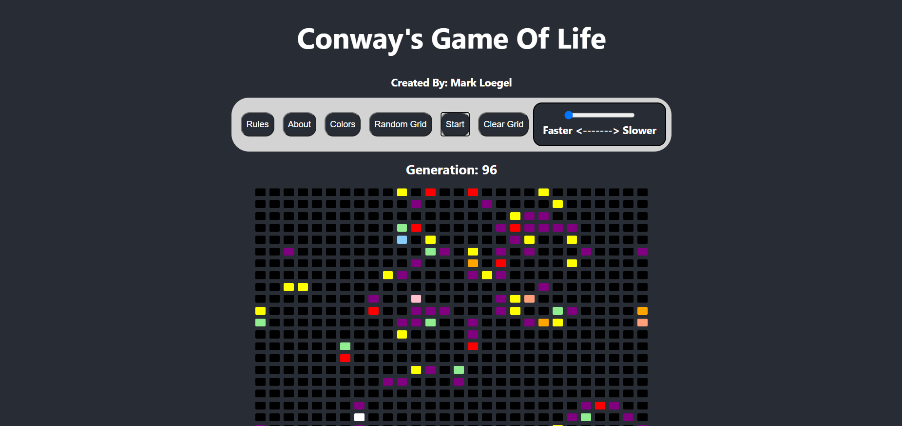
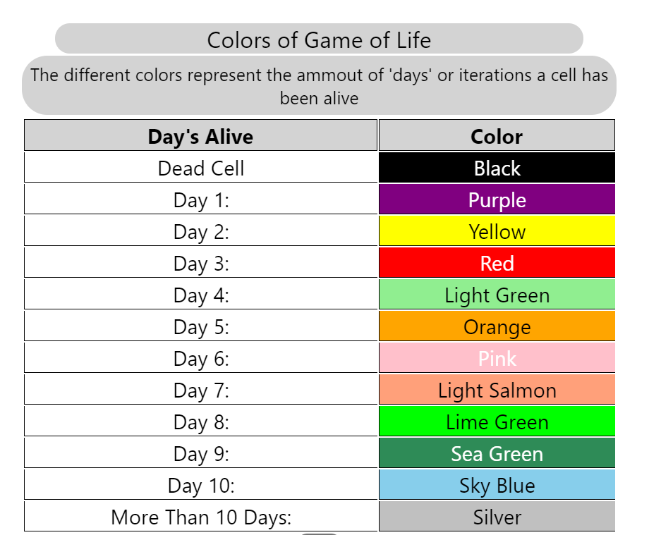
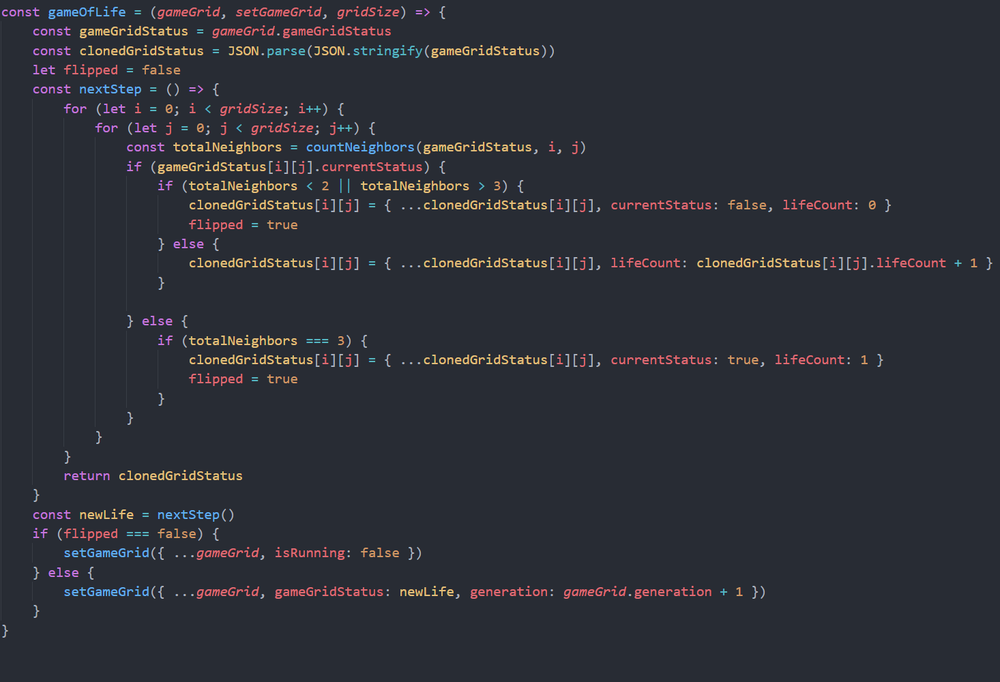
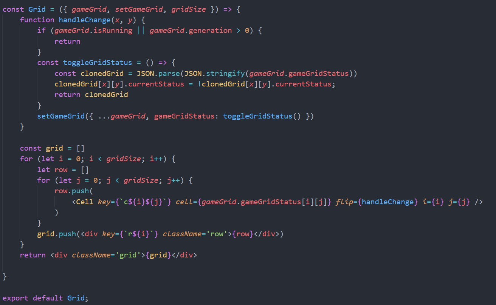
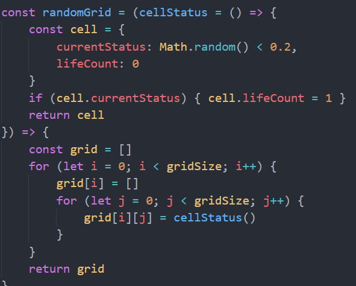

# Game Of Life

### Created By: Mark Loegel

### Deployed Link: https://game-of-life-bice.vercel.app/

## About

This project was a build week project for Lambda school. It was the project for the end of my 5th month of school. I buildt the project over a week period and enjoyed the process.

## Technologies Used

- React  
- Sass  
- ReactJs-Popus  
- Number-to-Words  

## Home Page

## Colors

## Code Snippets

### Here is the initialization of the game

### Here is the initialization of the grid

### Here creates the random grid

